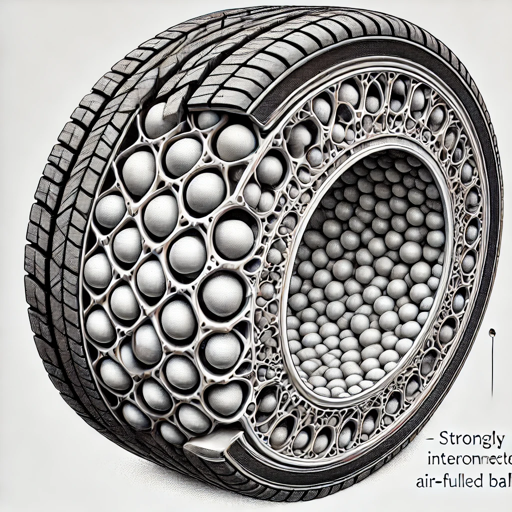

# 3D Printed Tire with Interconnected Air-Filled Balls

## Background of the Invention

### Field of the Invention
The present invention relates to tire technology, specifically to the design and manufacture of tires utilizing 3D printing techniques to create a network of interconnected air-filled balls within the tire structure. The invention aims to combine the advantages of both air-filled and airless tires while mitigating their respective disadvantages.

### Background Information
Traditional pneumatic tires rely on a continuous air-filled tube that can become flat when punctured. While airless tires have been proposed to avoid this issue, they often fail to provide the same level of performance and comfort as pneumatic tires. This invention addresses the need for a tire that offers the puncture resistance of airless designs while maintaining the flexibility and ride quality of air-filled tires.

## Summary of the Invention
The invention provides a tire structure made using a 3D printing process, where a network of interconnected air-filled balls is printed inside the tire using Thermoplastic Polyurethane (TPU) filament (or similar material). These balls are strongly interconnected and do not move within the tire, creating a stable structure. The 3D printing process occurs within a pressurized chamber, ensuring that the air pressure inside each ball is higher than the atmospheric pressure, further enhancing the tire’s performance.

## Detailed Description of the Invention

### Materials Used
The primary material used in the invention is TPU filament, known for its elasticity, durability, and resistance to abrasion. TPU's flexibility allows it to form the interconnected air-filled balls while maintaining the structural integrity of the tire.

### Structure and Configuration
The tire is designed with a network of interconnected air-filled balls embedded within the tire’s structure. These balls are evenly distributed and tightly interconnected to prevent movement within the tire. This configuration ensures that even if some of the balls are punctured, the overall structure remains intact, providing continued support and functionality.

### Manufacturing Process
The tire is manufactured using a 3D printing process inside a pressurized chamber. The pressurized environment ensures that each air-filled ball has a pressure higher than atmospheric pressure, which contributes to the tire's enhanced resilience and ride quality. The interconnected nature of the balls, combined with the pressurized air within each ball, creates a tire that is both puncture-resistant and capable of providing a smooth ride.

### Advantages
- **Puncture Resistance:** The tire's structure allows it to remain functional even if a few of the air-filled balls are punctured.
- **Ride Quality:** The elasticity of the TPU material and the air-filled balls contribute to a smooth, comfortable ride similar to traditional pneumatic tires.
- **Durability:** The interconnected design distributes stress evenly across the tire, increasing its lifespan.

## Claims

### Claim 1
A tire structure comprising a network of interconnected air-filled balls printed within the tire using Thermoplastic Polyurethane (TPU) filament, wherein the air-filled balls are tightly interconnected and do not move within the tire structure.

### Claim 2
The tire structure of Claim 1, wherein the 3D printing process occurs within a pressurized chamber, resulting in the air pressure inside each ball being higher than atmospheric pressure.

### Claim 3
The tire structure of Claim 1 or 2, wherein the interconnected air-filled balls are evenly distributed throughout the tire to provide consistent support and performance.

### Claim 4
The tire structure of any of the preceding claims, wherein the TPU filament used has properties of elasticity, durability, and abrasion resistance, contributing to the overall performance of the tire.

## Drawings or Diagrams

## Abstract
This invention relates to a tire structure manufactured using 3D printing techniques. The tire comprises a network of interconnected air-filled balls made from Thermoplastic Polyurethane (TPU) filament. These balls are printed within the tire in a pressurized chamber, ensuring that each ball contains air at a pressure higher than atmospheric pressure. The interconnected structure prevents movement within the tire and provides puncture resistance, improved ride quality, and enhanced durability.

## Inventor Information
- **Name:** Satoshi Nakajima
- **Contact Details:**: snakajima (twitter and github)

## Patent Application Declaration
I, Satoshi Nakajima, declare that I am the original inventor of the tire structure described in this patent application, and I believe the information provided is accurate and complete to the best of my knowledge.
